# Evaluation Scenarios

Each scenario describes a commit pattern, the expected result, and why. The git graphs show the full picture including feature branches and PR lifecycle. The tool only sees commits on `main` (via `--first-parent`), but the PR branch context determines whether the approval rules are satisfied.

---

## Scenarios

---

### 1. Standard PR with independent approval

**Description:** A developer opens a PR, a different developer reviews and approves it, then the PR is merged. The approval timestamp is after the latest commit in the PR. This is the happy path.

**Result:** `PASS` — PR has an independent approval after the latest code commit.

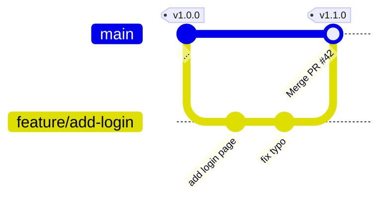

> `fix typo` committed at 10:00. Bob approves at 10:30. PR merged at 10:31.

---

### 2. Service account commit

**Description:** An automated process (CI bot, dependency updater, release script) pushes a commit. The author's name matches a pattern in `serviceAccounts` (e.g. `svc_.*`, `dependabot`). These commits are exempt from human review requirements.

**Result:** `PASS` — author matches a service account pattern.

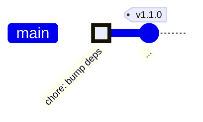

> Commit authored by `dependabot[bot]` — matches `svc_.*` pattern. Evaluation stops here.

---

### 3. GitHub merge commit — checked via PR

**Description:** When GitHub merges a PR using the "Create a merge commit" strategy, it produces a commit on `main` with two parents (the previous `main` tip and the feature branch tip). The control identifies this as a merge commit by parent count and applies the PR approval check, using only the PR branch commit authors — not the login of whoever clicked the Merge button, since they were executing a merge rather than contributing code.

**Result:** `PASS` — merge commit is linked to a PR that has an independent approval after the latest code commit.

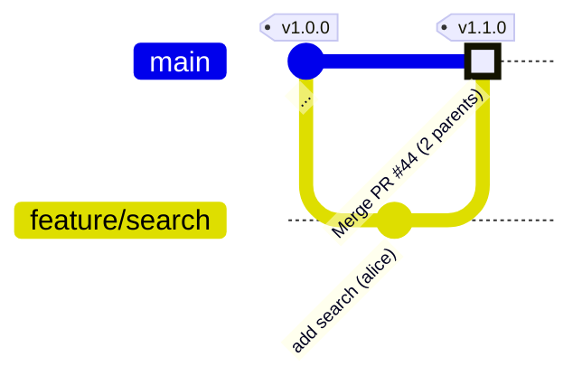

> Alice authors the branch commit. Bob approves the PR. GitHub creates the merge commit (2 parents). The approval check uses `pr_commit_authors` = {alice}; Bob's approval satisfies the check → PASS.

---

### 4. Fake merge commit message — bypass attempt

**Description:** A developer names a regular single-parent commit `"Merge pull request #42 from ..."` to trick the control into treating it as a merge commit and skipping the approval check. Because merge commit detection is based solely on parent count, not message text, the commit has only one parent and is correctly treated as a regular commit. It has no associated PR and fails.

**Result:** `FAIL` — single-parent commit with a fabricated merge message is not a merge commit; no associated PR found.

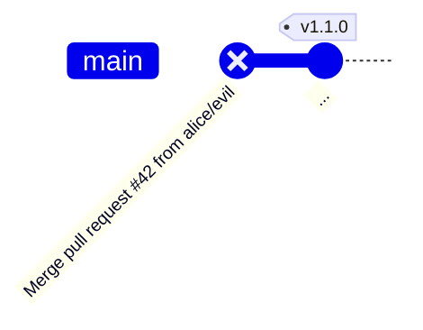

> Commit has one parent — `is_merge_commit` is false. No PR associated with this SHA → "no associated PR found" violation.

---

### 5. Commit pushed directly to main — no PR

**Description:** A developer bypasses the PR process and pushes directly to the main branch. The tool cannot find any merged PR associated with the commit SHA. Without a PR there can be no independent approval.

**Result:** `FAIL` — no associated PR found.

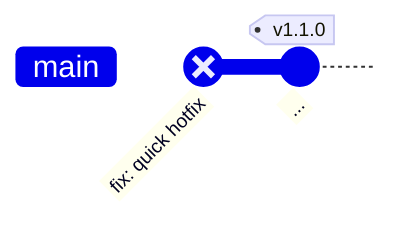

> Commit pushed directly to `main`. No PR exists in GitHub search results.

---

### 6. PR exists but has no approvals

**Description:** A PR was opened and merged, but no reviewer ever submitted an approval. The approvals list is empty. Without any approval there can be no independent one.

**Result:** `FAIL` — no independent approval (approvals list is empty).

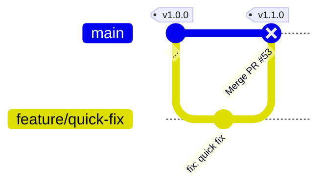

> PR #53 merged with zero approvals. No independent approval can be found → FAIL.

---

### 7. Self-approval only

**Description:** The PR author is the only person who approved the PR. There is no independent approver. The four-eyes principle requires that at least one approval comes from someone other than the commit author.

**Result:** `FAIL` — no independent approval (only self-approval).

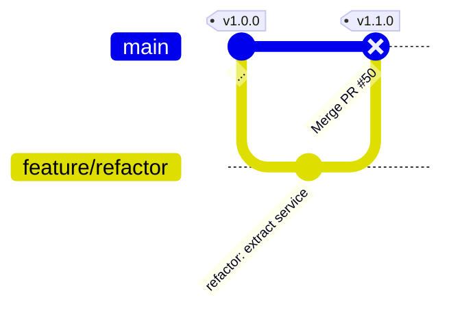

> PR #50 has one approval — from Alice, who is also the commit author. Self-approval does not satisfy four-eyes.

---

### 8. New code pushed after approval

**Description:** A reviewer approves the PR, but the developer then pushes additional commits after the approval. The approval predates the latest code commit, so the reviewer never saw the final state of the code.

**Result:** `FAIL` — approval exists but predates the latest commit.

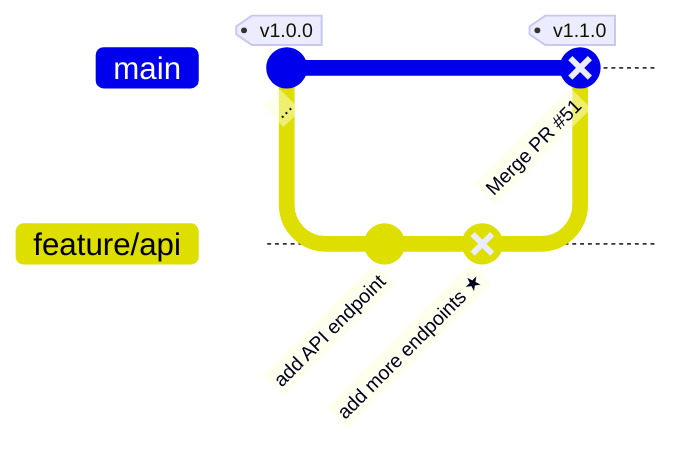

> Bob approves at 10:00. `★` pushed at 11:00. Approval is before the latest commit → FAIL.

---

### 11. Multiple commits — only failing ones reported

**Description:** A release range contains several commits. Some pass (e.g. authored by a service account) and some fail (e.g. pushed directly to main without a PR). The output only surfaces violations for the commits that actually fail; passing commits are not mentioned.

**Result:** `FAIL` for one commit; the other commit produces no violation. Only the failing SHA appears in the violations list.

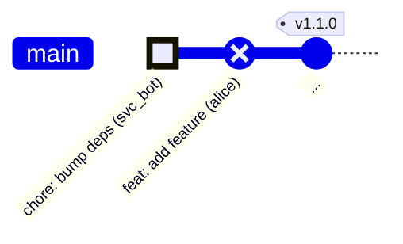

> `chore: bump deps` authored by `svc_bot` — service account, passes. `feat: add feature` pushed directly by `alice` — no PR, fails. Only `feat: add feature`'s SHA appears in violations.

---

### 13. Multi-author PR — cross-approval

**Description:** Two developers each commit to the same feature branch. Both also act as reviewers — Sami approves Faye's commit, and Faye approves Sami's commit. Each commit has at least one approval from someone other than its author.

**Result:** `PASS` — every commit has an independent approver.

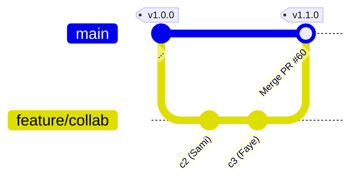

> Sami approves at 10:00 (independent for c3). Faye approves at 10:05 (independent for c2). All commits covered → PASS.

---

### 14. Multi-author PR — only one committer approves

**Description:** Two developers commit to the same branch, but only Faye approves the PR. Faye's approval is valid for Sami's commit (c2) since Faye didn't author it, but Faye cannot independently approve her own commit (c3). No other reviewer is present.

**Result:** `FAIL` — c3 has no independent approver (Faye self-approves).

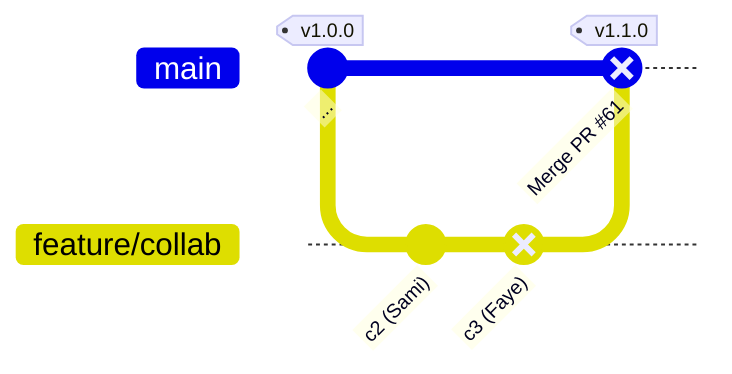

> Only Faye approves. Faye authored c3 — self-approval does not count. c3 has no independent approver → FAIL.

---

### 15. Direct commit on branch followed by PR in same release range

**Description:** A developer pushes a commit directly to the release branch (bypassing review), then later a separate change arrives via a proper PR with independent approval. The release range spans both. The direct commit has no associated PR and fails, even though the PR commits are fully compliant.

**Result:** `FAIL` — one commit in the range was pushed directly without a PR.

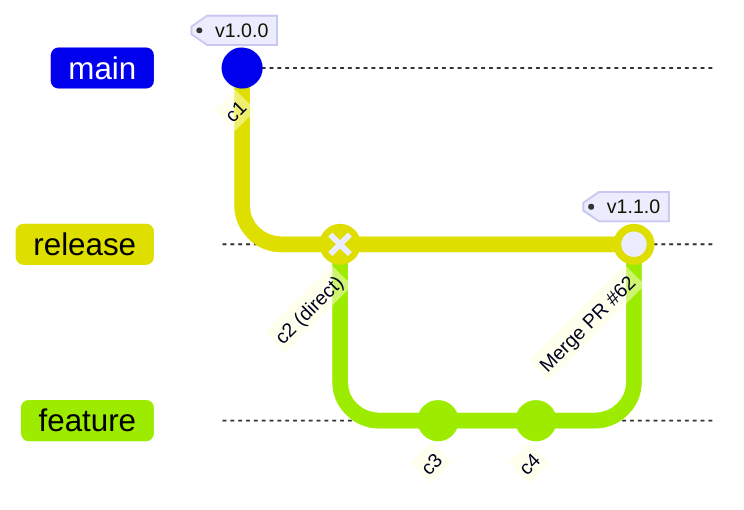

> c2 pushed directly to `release` — no PR found → FAIL. c3 and c4 arrived via a proper PR with independent approval — they pass. Only c2's SHA appears in violations.

---

### 16. Two PRs in release range — both independently approved

**Description:** A release range spans two separate merged PRs. Sami authors the first PR and Faye reviews it; Faye authors the second and Sami reviews it. Each PR has an independent approver. All commits in the range pass.

**Result:** `PASS` — every PR in the range has an independent approval.

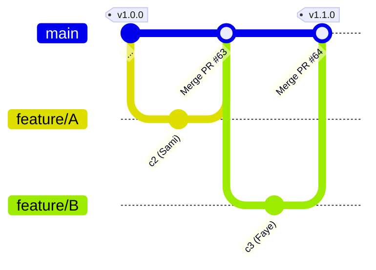

> PR #63: Sami authors, Faye approves → PASS. PR #64: Faye authors, Sami approves → PASS. No violations.

---

### 17. Two PRs in release range — one is self-approved

**Description:** Same as scenario 16, but Faye's PR is only approved by Faye herself. The tool correctly identifies which PR fails and surfaces only that commit in the violations list.

**Result:** `FAIL` — one PR in the range has only a self-approval.

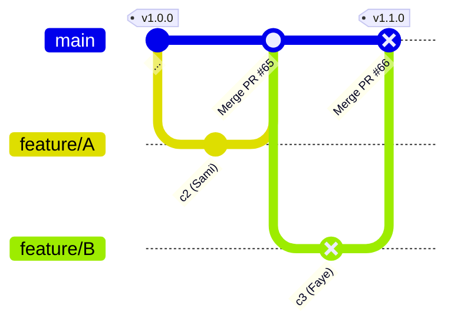

> PR #65: Sami authors, Faye approves → PASS. PR #66: Faye authors, only Faye approves → self-approval only, FAIL. Only c3's SHA appears in violations.
