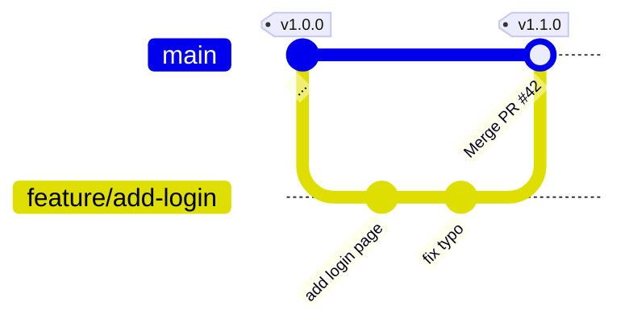
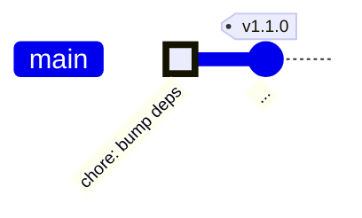
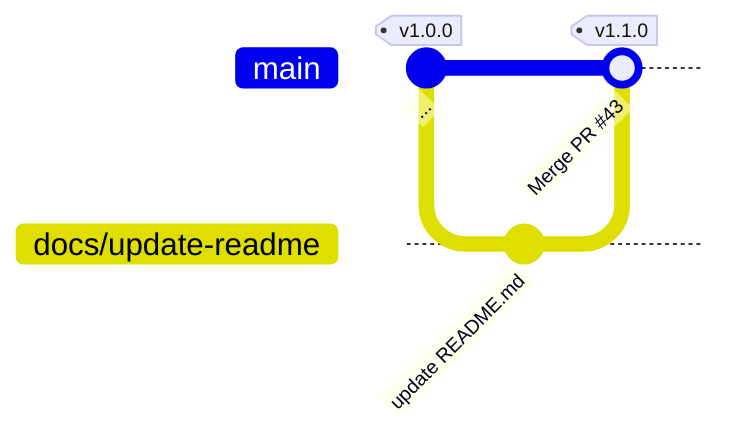
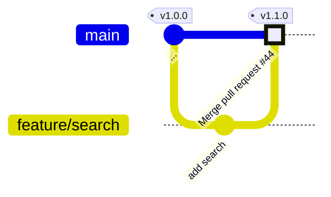
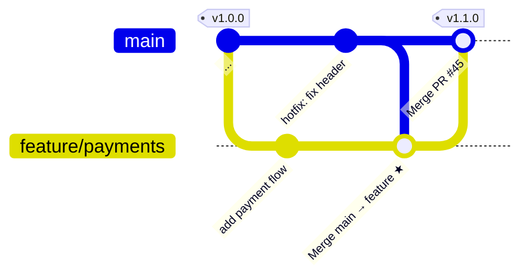
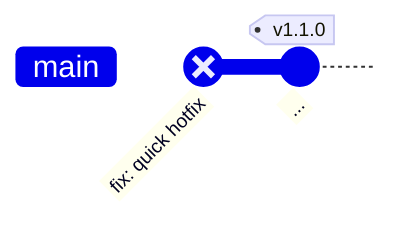
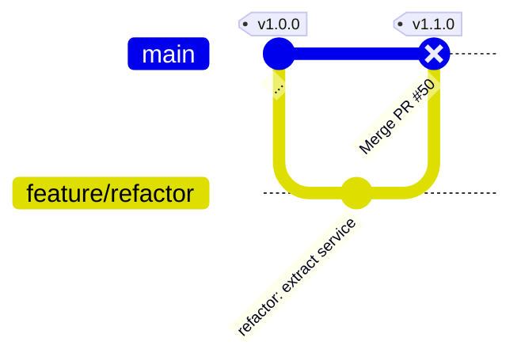
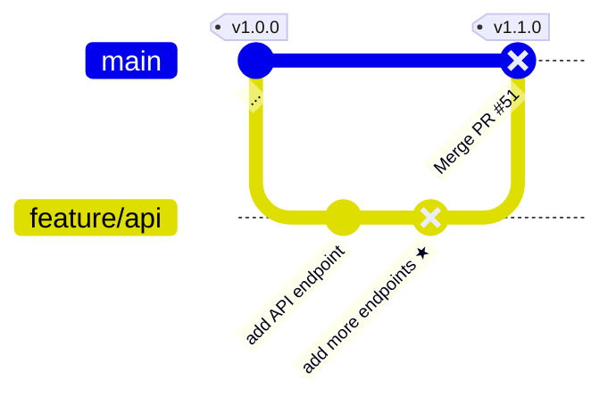
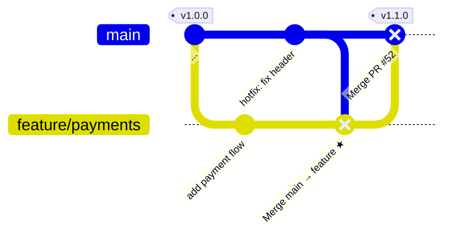

# Evaluation Scenarios

Each scenario describes a commit pattern, the expected result, and why. The git graphs show the full picture including feature branches and PR lifecycle. The tool only sees commits on `main` (via `--first-parent`), but the PR branch context determines whether the approval rules are satisfied.

---

## PASS Scenarios

---

### 1. Standard PR with independent approval

**Description:** A developer opens a PR, a different developer reviews and approves it, then the PR is merged. The approval timestamp is after the latest commit in the PR. This is the happy path.

**Result:** `PASS` — PR has an independent approval after the latest code commit.



> `fix typo` committed at 10:00. Bob approves at 10:30. PR merged at 10:31.

---

### 2. Service account commit

**Description:** An automated process (CI bot, dependency updater, release script) pushes a commit. The author's name matches a pattern in `serviceAccounts` (e.g. `svc_.*`, `dependabot`). These commits are exempt from human review requirements.

**Result:** `PASS` — author matches a service account pattern.



> Commit authored by `dependabot[bot]` — matches `svc_.*` pattern. Evaluation stops here.

---

### 3. Exempted files only

**Description:** A commit only touches files that are in the exemptions list (e.g. `README.md`, `package.json`, `.gitignore`). These files are considered low-risk and do not require a four-eyes review.

**Result:** `PASS` — all changed files are exempted.



> Only `README.md` changed. Matches `fileNames` exemption. No PR approval check needed.

---

### 4. GitHub merge commit

**Description:** When GitHub merges a PR via the UI or auto-merge, it creates a merge commit on the target branch with the message `Merge pull request #X from ...`. The tool recognises these as safe boundary commits and skips the approval check.

**Result:** `PASS` — commit is a GitHub merge commit.



> The merge commit on `main` has message `Merge pull request #44` — automatically passes.

---

### 5. Post-approval merge-from-base (`ignore` mode)

**Description:** A developer receives approval, then syncs their feature branch with `main` before merging (a `Merge branch 'main' into feature-x` commit). In `ignore` mode the merge-from-base commit is excluded from the timing check — the content it brings in was already reviewed on `main`. The approval still post-dates the actual code changes.

**Result:** `PASS` — merge-from-base commits excluded; approval is after the latest code commit.



> `add payment flow` committed at 09:00. Alice approves at 10:00. `★` merge-from-base at 11:00 (excluded in `ignore` mode). PR merged at 11:05. → PASS

---

### 6. Multiple PRs for one commit (any qualifies)

**Description:** A commit SHA appears in more than one PR (e.g. a cherry-pick or backport). The tool checks all matching PRs. If any of them has a valid independent approval after the latest code commit, the commit passes.

**Result:** `PASS` — PR #47 lacks approval, but PR #48 has a valid independent approval.

```mermaid
gitGraph
   commit id: "..." tag: "v1.0.0"
   branch feature/fix
   commit id: "fix: edge case ★"
   checkout main
   merge feature/fix id: "Merge PR #47"
   branch release/1.1
   cherry-pick id: "fix: edge case ★ (backport)"
   checkout main
   commit id: "..." tag: "v1.1.0"
```

> `★` appears in both PR #47 (no approval) and PR #48 (approved by Bob). Tool finds PR #48 → PASS.

---

## FAIL Scenarios

---

### 7. Commit pushed directly to main — no PR

**Description:** A developer bypasses the PR process and pushes directly to the main branch. The tool cannot find any merged PR associated with the commit SHA. Without a PR there can be no independent approval.

**Result:** `FAIL` — no associated PR found.



> Commit pushed directly to `main`. No PR exists in GitHub search results.

---

### 8. Self-approval only

**Description:** The PR author is the only person who approved the PR. There is no independent approver. The four-eyes principle requires that at least one approval comes from someone other than the commit author.

**Result:** `FAIL` — no independent approval (only self-approval).



> PR #50 has one approval — from Alice, who is also the commit author. Self-approval does not satisfy four-eyes.

---

### 9. New code pushed after approval

**Description:** A reviewer approves the PR, but the developer then pushes additional commits after the approval. The approval predates the latest code commit, so the reviewer never saw the final state of the code.

**Result:** `FAIL` — approval exists but predates the latest commit.



> Bob approves at 10:00. `★` pushed at 11:00. Approval is before the latest commit → FAIL.

---

### 10. Post-approval merge-from-base (`strict` mode)

**Description:** Same as scenario 5, but the policy is set to `strict`. In strict mode every commit — including merge-from-base commits — must be preceded by a valid approval. Since the merge-from-base commit was pushed after the last approval, the check fails.

**Result:** `FAIL` — merge-from-base commit post-dates the last approval (strict mode).



> `add payment flow` at 09:00. Alice approves at 10:00. `★` merge-from-base at 11:00. In `strict` mode the `★` commit invalidates the approval → FAIL.

> Switch to `post_approval_merge_commits := "ignore"` in `four-eyes.rego` to treat this as scenario 5 (PASS).
